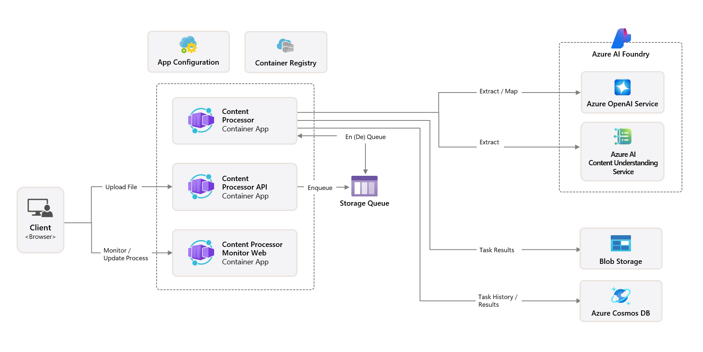
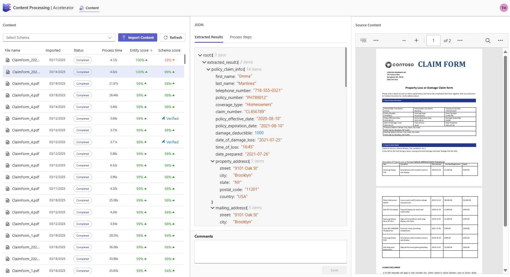

# Content processing solution accelerator
This solution accelerator enables customers to programmatically extract data and apply schemas to unstructured documents across text-based and multi-modal content. During processing, extraction and data schema transformation - these steps are scored for accuracy to automate processing and identify as-needed human validation. This allows for improved accuracy and greater speed for data integration into downstream systems. 

 

  
[**SOLUTION OVERVIEW**](#solution-overview)  \| [**QUICK DEPLOY**](#quick-deploy)  \| [**BUSINESS SCENARIO**](#business-scenario)  \| [**SUPPORTING DOCUMENTATION**](#supporting-documentation)

 

<h2>
Solution overview
</h2>

The solution leverages Azure AI Foundry, Azure AI Content Understanding, Azure OpenAI Service, Azure blob storage, and Azure Cosmos DB to transform large volumes of unstructured content through event-driven processing pipelines for integration into downstream applications and post-processing activities.

### Solution architecture
||
|---|

### How to customize
If you'd like to customize the solution accelerator, here are some common areas to start:

[Adding your own Schemas and Data](./docs/CustomizeSchemaData.md)

[Modifying System Processing Prompts](./docs/CustomizeSystemPrompts.md)

[Ingesting API for Event-Driven Processing](./docs/API.md)

 

### Additional resources

[Technical Architecture](./docs/TechnicalArchitecture.md)

[Technical Approach & Processing Pipeline](./docs/ProcessingPipelineApproach.md)

 

### Key features

  
Click to learn more about the key features this solution enables

  - **Multi-modal content processing**  
  Utilizes machine learning-based OCR for efficient text extraction and integrates GPT Vision for processing various content formats.​

  - **Schema-based data transformation**  
  Maps extracted content to custom or industry-defined schemas and outputs as JSON for interoperability

  - **Confidence scoring**  
  Calculation of entity extraction and schema mapping processes for accuracy, providing scores to drive manual human-in-the-loop review, if desired

  - **Review, validate, update**  
  Transparency in reviewing processing steps and final output - allowing for review, comparison to source asset, ability to modify output results, and annotation for historical reference

  - **API driven processing pipelinese**  
  API end-points are available for external source systems to integrate event-driven processing workflows
         

  
<h2>
Quick deploy
</h2>

### How to install or deploy
Follow the quick deploy steps on the deployment guide to deploy this solution to your own Azure subscription.

[Click here to launch the deployment guide](./docs/DeploymentGuide.md)
  

|  |  | 
|---|---|

 

> ⚠️ **Important: Check Azure OpenAI Quota Availability**
  To ensure sufficient quota is available in your subscription, please follow [quota check instructions guide](./docs/QuotaCheck.md) before you deploy the solution.

 

### Prerequisites and Costs
To deploy this solution accelerator, ensure you have access to an [Azure subscription](https://azure.microsoft.com/free/) with the necessary permissions to create **resource groups, resources, app registrations, and assign roles at the resource group level**. This should include Contributor role at the subscription level and Role Based Access Control role on the subscription and/or resource group level. Follow the steps in [Azure Account Set Up](./docs/AzureAccountSetUp.md).

Here are some example regions where the services are available: East US, East US2, Australia East, UK South, France Central, Africa.

Check the [Azure Products by Region](https://azure.microsoft.com/en-us/explore/global-infrastructure/products-by-region/?products=all&regions=all) page and select a **region** where the following services are available.

Pricing varies per region and usage, so it isn't possible to predict exact costs for your usage. The majority of the Azure resources used in this infrastructure are on usage-based pricing tiers. However, Azure Container Registry has a fixed cost per registry per day.

Use the [Azure pricing calculator](https://azure.microsoft.com/en-us/pricing/calculator) to calculate the cost of this solution in your subscription. [Review a sample pricing sheet for the achitecture](https://azure.com/e/68b51f4cb79a4466b631a11aa57e9c16).

 

| Product | Description | Cost |
|---|---|---|
| [Azure AI Foundry](https://learn.microsoft.com/en-us/azure/ai-foundry/) | Build generative AI applications on an enterprise-grade platform | [Pricing](https://azure.microsoft.com/pricing/details/ai-studio/) |
| [Azure OpenAI Service](https://learn.microsoft.com/en-us/azure/ai-services/openai/) | Provides REST API access to OpenAI's powerful language models including o3-mini, o1, o1-mini, GPT-4o, GPT-4o mini | [Pricing](https://azure.microsoft.com/en-us/pricing/details/cognitive-services/openai-service/) |
| [Azure AI Content Understanding Service](https://learn.microsoft.com/en-us/azure/ai-services/content-understanding/) | Analyzes various media content—such as audio, video, text, and images—transforming it into structured, searchable data | [Pricing](https://azure.microsoft.com/en-us/pricing/details/content-understanding/) |
| [Azure Blob Storage](https://learn.microsoft.com/en-us/azure/storage/blobs/) | Microsoft's object storage solution for the cloud. Blob storage is optimized for storing massive amounts of unstructured data | [Pricing](https://azure.microsoft.com/pricing/details/storage/blobs/) |
| [Azure Container Apps](https://learn.microsoft.com/en-us/azure/container-apps/) | Allows you to run containerized applications without worrying about orchestration or infrastructure. | [Pricing](https://azure.microsoft.com/pricing/details/container-apps/) |
| [Azure Container Registry](https://learn.microsoft.com/en-us/azure/container-registry/) | Build, store, and manage container images and artifacts in a private registry for all types of container deployments | [Pricing](https://azure.microsoft.com/pricing/details/container-registry/) |
| [Azure Cosmos DB](https://learn.microsoft.com/en-us/azure/cosmos-db/) | Fully managed, distributed NoSQL, relational, and vector database for modern app development | [Pricing](https://azure.microsoft.com/en-us/pricing/details/cosmos-db/autoscale-provisioned/) |
| [Azure Queue Storage](https://learn.microsoft.com/en-us/azure/storage/queues/) | Store large numbers of messages and access messages from anywhere in the world via HTTP or HTTPS. | [Pricing]() |
| [GPT Model Capacity](https://learn.microsoft.com/en-us/azure/ai-services/openai/concepts/models) | The latest most capable Azure OpenAI models with multimodal versions, accepting both text and images as input | [Pricing](https://azure.microsoft.com/en-us/pricing/details/cognitive-services/openai-service/) |

 

>⚠️ **Important:** To avoid unnecessary costs, remember to take down your app if it's no longer in use,
either by deleting the resource group in the Portal or running `azd down`.

  
<h2>
Business Scenario
</h2>

||
|---|

 

A data analyst at a property insurance company manages and ensures claims for data accuracy and compliance.

A recent natural disaster has led to an influx of insurance claims coming into the pipeline. The analyst is tasked with accurately validating ingested data from claims and invoices being processed through the system. Claims data includes various multi-modal content types, with details extracted and mapped to defined schemas such as policy plans, invoices, and insurance adjuster reports.

AI is used to extract, transform, and flag potential discrepancies, such as missing policyholder details and outlier repair estimates. The data analyst then cross-checks the findings against historical claims data and regulatory guidelines. Collaborating with the compliance team, she verifies the flagged issues and refines the dataset.

Thanks to AI pipeline processing, data moves much faster, more accurately, and is more seamlessly integrated into the data analyst's workflow.

⚠️ The sample data used in this repository is synthetic and generated using Azure OpenAI service. The data is intended for use as sample data only.

 

### Business value

  
Click to learn more about what value this solution provides

 
  - **Automated data management**  
  Streamline data management to enable event-driven automation. While standardizing the data structure for a reusable experience, improving productivity at scale.

  - **Enhanced data processing**  
  Efficiently extract key details, keywords, and entities, to automatically map them to the specified schemas, optimizing workflows, reducing manual effort and saving time.

  - **Data confidence**  
  Systematic extraction and mapping elevate confidence in AI workflows by applying tolerance thresholds and ensuring quality results through scoring, all while enhancing accuracy.

  - **Verifiable Approvals**  
  Human verification of processed content ensures reliability and precision of the final output when thresholds are not met, while fostering trust and guaranteeing consistency.

  

<h2>
Supporting documentation
</h2>

### Security guidelines

This template uses Azure Key Vault to store all connections to communicate between resources.

This template also uses [Managed Identity](https://learn.microsoft.com/entra/identity/managed-identities-azure-resources/overview) for local development and deployment.

To ensure continued best practices in your own repository, we recommend that anyone creating solutions based on our templates ensure that the [Github secret scanning](https://docs.github.com/code-security/secret-scanning/about-secret-scanning) setting is enabled.

You may want to consider additional security measures, such as:

* Enabling Microsoft Defender for Cloud to [secure your Azure resources](https://learn.microsoft.com/azure/security-center/defender-for-cloud).
* Protecting the Azure Container Apps instance with a [firewall](https://learn.microsoft.com/azure/container-apps/waf-app-gateway) and/or [Virtual Network](https://learn.microsoft.com/azure/container-apps/networking?tabs=workload-profiles-env%2Cazure-cli).

 

### Frequently asked questions
[Click here]() to learn more about common questions about this solution.

 

### Cross references
Check out similar solution accelerators
 

| Solution Accelerator | Description |
|---|---|
| [Document&nbsp;knowledge&nbsp;mining](https://github.com/microsoft/Document-Knowledge-Mining-Solution-Accelerator) | Provides REST API access to OpenAI's powerful language models including o3-mini, o1, o1-mini, GPT-4o, GPT-4o mini |
| [Conversation&nbsp;knowledge&nbsp;mining](https://github.com/microsoft/Conversation-Knowledge-Mining-Solution-Accelerator) | Description of solution accelerator |
| [Document&nbsp;generation](https://github.com/microsoft/document-generation-solution-accelerator) | Analyzes various media content—such as audio, video, text, and images—transforming it into structured, searchable data |

    

## Provide feedback
Have questions, find a bug, or want to request a feature? [Submit a new issue](https://github.com/microsoft/content-processing-solution-accelerator/issues) on this repo and we'll connect.

 

## Responsible AI Transparency FAQ 
Please refer to [Transparency FAQ](./TRANSPARENCY_FAQ.md) for responsible AI transparency details of this solution accelerator.

 

## Disclaimers

To the extent that the Software includes components or code used in or derived from Microsoft products or services, including without limitation Microsoft Azure Services (collectively, “Microsoft Products and Services”), you must also comply with the Product Terms applicable to such Microsoft Products and Services. You acknowledge and agree that the license governing the Software does not grant you a license or other right to use Microsoft Products and Services. Nothing in the license or this ReadMe file will serve to supersede, amend, terminate or modify any terms in the Product Terms for any Microsoft Products and Services. 

You must also comply with all domestic and international export laws and regulations that apply to the Software, which include restrictions on destinations, end users, and end use. For further information on export restrictions, visit https://aka.ms/exporting. 

You acknowledge that the Software and Microsoft Products and Services (1) are not designed, intended or made available as a medical device(s), and (2) are not designed or intended to be a substitute for professional medical advice, diagnosis, treatment, or judgment and should not be used to replace or as a substitute for professional medical advice, diagnosis, treatment, or judgment. Customer is solely responsible for displaying and/or obtaining appropriate consents, warnings, disclaimers, and acknowledgements to end users of Customer’s implementation of the Online Services. 

You acknowledge the Software is not subject to SOC 1 and SOC 2 compliance audits. No Microsoft technology, nor any of its component technologies, including the Software, is intended or made available as a substitute for the professional advice, opinion, or judgement of a certified financial services professional. Do not use the Software to replace, substitute, or provide professional financial advice or judgment.  

BY ACCESSING OR USING THE SOFTWARE, YOU ACKNOWLEDGE THAT THE SOFTWARE IS NOT DESIGNED OR INTENDED TO SUPPORT ANY USE IN WHICH A SERVICE INTERRUPTION, DEFECT, ERROR, OR OTHER FAILURE OF THE SOFTWARE COULD RESULT IN THE DEATH OR SERIOUS BODILY INJURY OF ANY PERSON OR IN PHYSICAL OR ENVIRONMENTAL DAMAGE (COLLECTIVELY, “HIGH-RISK USE”), AND THAT YOU WILL ENSURE THAT, IN THE EVENT OF ANY INTERRUPTION, DEFECT, ERROR, OR OTHER FAILURE OF THE SOFTWARE, THE SAFETY OF PEOPLE, PROPERTY, AND THE ENVIRONMENT ARE NOT REDUCED BELOW A LEVEL THAT IS REASONABLY, APPROPRIATE, AND LEGAL, WHETHER IN GENERAL OR IN A SPECIFIC INDUSTRY. BY ACCESSING THE SOFTWARE, YOU FURTHER ACKNOWLEDGE THAT YOUR HIGH-RISK USE OF THE SOFTWARE IS AT YOUR OWN RISK.  